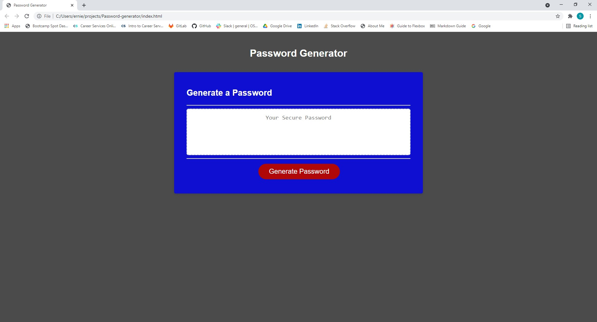

# Password Generator
Created by Shawn Miller

# Technologies Used
- HTML
- CSS
- Javascript

# Description
This website was made to generator random passwords based on the criteria given by prompts that a user answers.

The criteria that is asked to the user is:
- Number of characters needed for the password be (8 -128).
- Use of uppercase letters?
- Use of lowercase letters?
- Use of special characters?
- Use of numbers?

# Appearance

# Known Bugs
No known bugs

## Contact info
shawnsmm@gmail.com